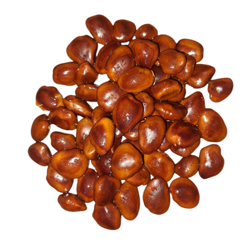
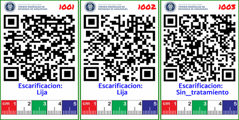
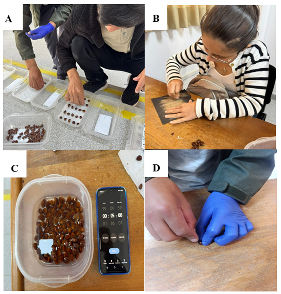
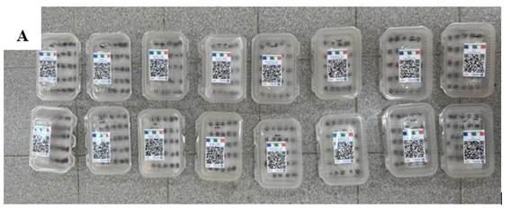

## Materiales

### Material vegetal

Las semillas utilizadas corresponden a frutos de tamarindo seleccionados por su buen estado de madurez y apariencia saludable. Estas fueron adquiridas en el mercado modelo de la ciudad de Chachapoyas, región Amazonas. Posteriormente, se realizó una selección manual de las semillas, descartando aquellas que presentaban daños físicos, manchas, perforaciones, signos de deterioro o impurezas. Solo se consideraron las semillas con mayor integridad física, uniformidad y apariencia vigorosa para su utilización en el proceso experimental.

{fig-align="center" width="280"}

**Figura 1**. Semillas de Tamarindo (*Tamarindus indica*)

### Materiales e instrumentos

Para la ejecución del trabajo se utiliza papel tolla, bisturí, agua, cinta scotch, ligas, guantes, jarra hervidora y dieseis tapers transparentes de polipropileno esto con la finalidad de realizar el trabajo de manera ordenada, segura y eficiente. Estos materiales nos permitieron la manipulación,el almacenamiento y la protección adecuada de las semillas durante todo el proceso, garantizando limpieza y una mejor organización.

{fig-align="center" width="400"}

**Figura 2**. Materiales utilizados

## Métodología

### Elaboración de libro de campo y etiquetas

Mediante la plataforma interactiva Tarpuy, desde el entorno de R, se elaboró el libro de campo para la planificación y organización del experimento en semillas de tamarindo, el cual estuvo constituido por cuatro tratamientos: T0: Control (sin escarificación), T1: Mecánica: Lijado superficial del tegumento, T2: Térmica (inmersión en agua caliente) y T3: Corte mecánico (incisión con bisturí). La información experimental fue sistematizada en una hoja de cálculo de Google Sheets e importada a R mediante el paquete googlesheets4 para su procesamiento y gestión. Asimismo, las etiquetas de identificación fueron generadas con el paquete huito de R, incorporando información de los tratamientos e imágenes referenciales, como el logotipo institucional, permitiendo una identificación estandarizada y el adecuado seguimiento de las unidades experimentales durante la fase de germinación.

{fig-align="center"}

**Figura 3**. Etiquetas del experimento

### Procedimiento experimental

El experimento se realizó en aulas de la universidad Nacional Toribio Rodríguez de Mendoza, en primer lugar, se etiqueto los dieseis tapers, posteriormente se colocó papel toalla en cada uno. Una vez seleccionada la semilla y obtenidos todos los materiales se inició con el desarrollo de cada tratamiento. (Figura 4). Mediante el desarrollo del experimento, para el tratamiento T0: Control, se tomó 100 semillas del cual se realizó cuatro repeticiones de 25 semillas cada uno y se agregó agua con ayuda de una jeringa. Luego para T1: Mecánica, se tomó las semillas de una en una realizando el lijado superficial. En cuanto al T2: Térmica, se utilizó una jarra hervidora de un litro, se calentó el agua hasta lo 100°c, en seguida se dejó reposar el agua por cuatro minutos, luego se con ayuda de un recipiente se colocó las 100 semillas de tamarindo por un tiempo de cinco minutos y para el T3: Corte mecánico, se utilizó cuidadosamente un bisturí realizando un corte de la testa de cada una de las semillas.

{fig-align="center"}

**Figura 4***.* Desarrollo del experimento.  **(A)** T0: Control (sin escarificación). **(B)** T1: Mecánica:  Lijado superficial del tegumento. **(C)** T2: Térmica (inmersión en agua caliente) y **(D)** T3: Corte mecánico (incisión con bisturí).                      \

### Diseño del experimento

La evaluación se realizó utilizando un Diseño Completamente al Azar (DCA), con el propósito de evaluar el efecto de diferentes métodos de escarificación en la germinación de semillas de tamarindo. Para el trabajo se establecieron cuatro tratamientos, conformados por un tratamiento control y tres métodos escarificación, los cuales permitirán comparar la efectividad de cada técnica sobre la capacidad germinativa de las semillas. En cada tratamiento se realizó con cuatro réplicas, a fin de garantizar mayor precisión y confiabilidad en los resultados experimentales. La unidad experimental se constituyó por 25 semillas de tamarindo por repetición, en total se utilizaron 400 semillas de tamarindo, de manera que cada tratamiento será evaluado y registrado bajo condiciones similares por un periodo de11 días, reduciendo así la variabilidad y facilitando el análisis estadístico de los datos obtenidos.

{fig-align="center"}

**Figura 5.** Distribución de los tratamientos
