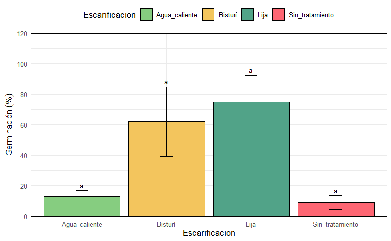
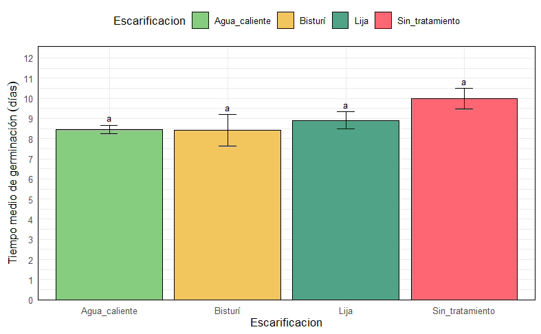
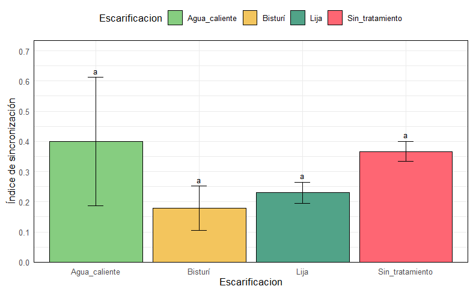

## Resultados

Mediante el presente experimento se evaluó el efecto de diferentes métodos de escarificación sobre la germinación de semillas de (Tamarindus indica) con dormancia física, con el objetivo de analizar su comportamiento germinativo a partir de tres índices clave: el porcentaje de germinación (GRP), el tiempo medio de germinación (MGT) y el índice de sincronización (SYN). Los datos fueron sometidos a un análisis de varianza (ANOVA) y a pruebas de comparación de medias, considerando un nivel de significancia de α = 0.05. A continuación, se presentan los resultados obtenidos.

### Porcentaje de germinación (GRP)

{fig-align="center"}

**Figura 1**. Porcentaje de germinación de las semillas de tamarindo mediante metodos de escarificación

En la figura 1, se observa que el el tratamiento con lija registró el valor más alto de germinación, cercano al 75 %, seguido del tratamiento con bisturí, con aproximadamente 62 %. Por otro lado, los tratamientos con agua caliente y sin tratamiento mostraron valores menores, alrededor de 13 % y 10 %, respectivamente. Las barras de error evidencian variabilidad en los datos obtenidos, siendo más amplias en los tratamientos con bisturí y lija. Por su parte las barras presentan la letra “a”, lo que indica que, de acuerdo con la prueba estadística realizada, no se encontraron diferencias significativas entre los tratamientos evaluados.

### Tiempo medio de germinación (mgt)

{fig-align="center"}

**Figura 2.** Tiempo medio de germinación (mgt) en semillas de Tamarindo

La figura 2, muestra el tiemp los tratamientos con agua caliente y bisturí presentaron los menores tiempos medios de germinación, con valores cercanos a 8 días, mientras que el tratamiento con lija registró un valor ligeramente mayor, alrededor de 9 días. Por su parte, el tratamiento T0 (sin_tratamiento) mostró el mayor tiempo medio de germinación, con aproximadamente 10 días. Las barras de error evidencian variabilidad en los datos obtenidos para cada tratamiento, siendo más amplias en el tratamiento con bisturí. Asimismo, todas las barras presentan la letra “a”, lo que indica que, de acuerdo con la prueba estadística realizada, no se encontraron diferencias significativas entre los tratamientos evaluados.

### Índice de sincronización (syn)

{fig-align="center"}

**Figura 3.** Tiempo medio de germinación (syn) en semillas de Tamarindo

La figura 3 muestra que, el tratamiento con agua caliente presentó el mayor índice de sincronización, con un valor cercano a 0.40, seguido del tratamiento sin tratamiento, con aproximadamente 0.36. Por otro lado, los tratamientos con lija y bisturí registraron valores menores, alrededor de 0.23 y 0.18, respectivamente. Las barras de error evidencian variabilidad en los datos obtenidos para cada tratamiento, siendo más amplias en el tratamiento con agua caliente. Asimismo, todas las barras presentan la letra “a”, lo que indica que, de acuerdo con la prueba estadística realizada, no se encontraron diferencias significativas entre los tratamientos evaluados.

## Discusiones
