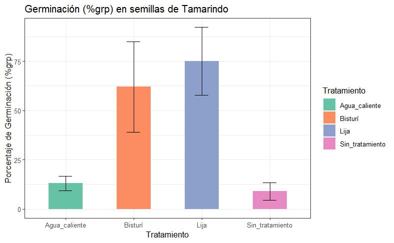
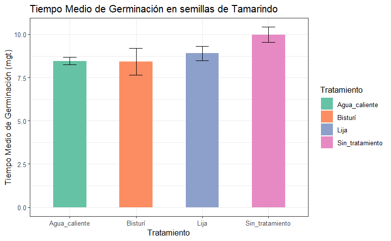
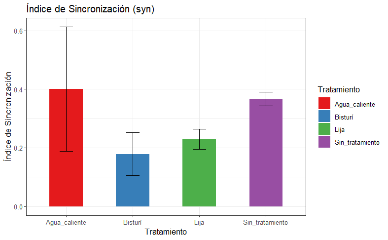

## Resultados

Mediante el presente experimento se evaluó el efecto de diferentes métodos de escarificación sobre la germinación de semillas de (Tamarindus indica) con dormancia física, con el objetivo de analizar su comportamiento germinativo a partir de tres índices clave: el porcentaje de germinación (GRP), el tiempo medio de germinación (MGT) y el índice de sincronización (SYN). Los datos fueron sometidos a un análisis de varianza (ANOVA) y a pruebas de comparación de medias, considerando un nivel de significancia de α = 0.05. A continuación, se presentan los resultados obtenidos.

### Porcentaje de germinación (GRP)

{fig-align="center"}

**Figura 1**. Porcentaje de germinación de las semillas de tamarindo mediante metodos de escarificación

En la figura 1, se observa que el tratamiento con lija alcanzó el mayor porcentaje de germinación, registrando valores cercanos al 75 %, seguido del tratamiento con bisturí, que presentó un porcentaje intermedio-alto alrededor del 60 %. En cambio, los tratamientos con agua caliente y sin tratamiento mostraron porcentajes de germinación considerablemente menores, con valores próximos entre 10 y 15 %.

### Tiempo medio de germinación (mgt)

{fig-align="center"}

**Figura 2.** Tiempo medio de germinación (mgt) en semillas de Tamarindo

En la figura 2. Se muestra que T0 (Sin_tratamiento) registró el mayor tiempo medio de germinación, con valores cercanos a 10 días. Por otro lado, los tratamientos con agua caliente y bisturí presentaron los menores tiempos medios de germinación, con valores aproximados de 8 días, mientras que el tratamiento con lija mostró un valor ligeramente superior, cercano a 9 días.

### Índice de sincronización (syn)

{fig-align="center"}

**Figura 3.** Tiempo medio de germinación (mgt) en semillas de Tamarindo

En la figiura 3. Se muestra que el tratamiento con agua caliente registró el mayor índice de sincronización, con valores cercanos a 0.40, seguido del tratamiento sin tratamiento, con un valor aproximado de 0.37. Por otro lado, el tratamiento con lija presentó un valor intermedio cercano a 0.23, mientras que el tratamiento con bisturí mostró el menor índice de sincronización, alrededor de 0.18. Asimismo, las barras de error evidencian variabilidad en los datos obtenidos para cada tratamiento, siendo más amplias en el tratamiento con agua caliente y más reducidas en los tratamientos con lija y sin tratamiento.

## Discusiones

